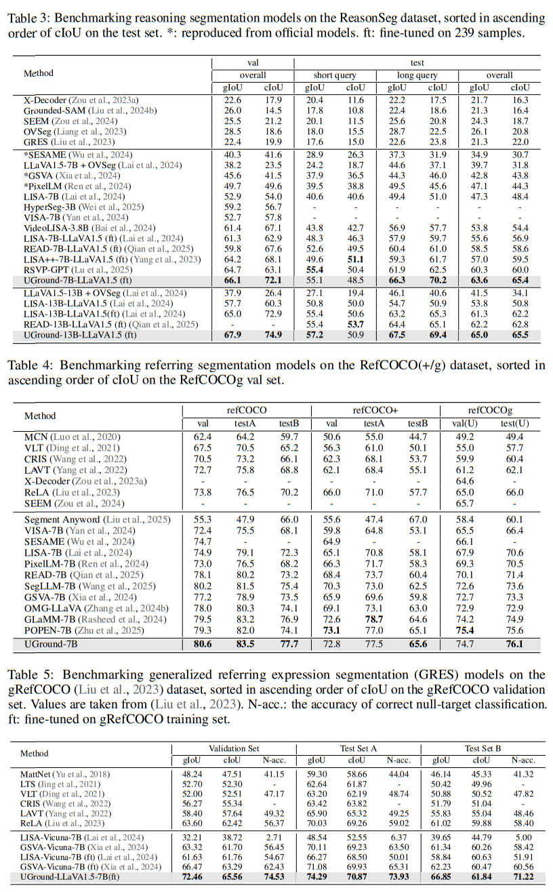

<p align="center">
  
</p>

# UGround: Towards Unified Visual Grounding with Unrolled Transformers

[](https://lbesson.mit-license.org/)  [](https://arxiv.org/abs/2412.17741) 

This repo provides the PyTorch source code of our paper: [UGround: Towards Unified Visual Grounding with Unrolled Transformers](https://arxiv.org/abs/2412.17741).

It is also the official code release of [\[READ\]](https://github.com/rui-qian/READ), [CVPR'25](https://openaccess.thecvf.com/content/CVPR2025/papers/Qian_Reasoning_to_Attend_Try_to_Understand_How_SEG_Token_Works_CVPR_2025_paper.pdf), see also: [\[arXiv\]](https://arxiv.org/abs/2412.17741).

**Authors**: 
[Rui Qian](https://scholar.google.com.hk/citations?user=z3sAW3oAAAAJ&hl=zh-CN), 
[Xin Yin](https://scholar.google.com.hk/citations?hl=zh-CN&user=v3OOQQkAAAAJ), 
[Chuanhang Deng](https://scholar.google.com/citations?hl=zh-CN&user=xUxVwu0AAAAJ),
[Zhiyuan Peng](https://scholar.google.com.hk/citations?hl=zh-CN&user=kfiyUgIAAAAJ),
[Jian Xiong](https://scholar.google.com.hk/citations?hl=zh-CN&user=ePOXfkAAAAAJ),
[Wei Zhai](https://scholar.google.com.hk/citations?hl=zh-CN&user=seIo-acAAAAJ),
[Dejing Dou†](https://scholar.google.com.hk/citations?hl=zh-CN&user=qBHsQ04AAAAJ). 

## Abstract
We present UGround, a **U**nified visual **Ground**ing paradigm that dynamically selects 
intermediate layers across **U**nrolled transformers as ''mask as prompt'', diverging from the 
prevailing pipeline that leverages the fixed last hidden layer as ''\<SEG\> as prompt''. UGround addresses two primary challenges posed by the prevailing paradigm: (1) its reliance on the fixed last hidden layer, which sequentially amplifies cumulative errors arising from layer-by-layer propagation without intermediate correction, and (2) its use of \<SEG\> as a prompt, which implicitly projects textual embeddings into visual space without explicit spatial cues (e.g., coordinates). Central to UGround is Policy-Prompted Masking, which comprises two key components: Stochastic Skip Connection (SSC) and Mask as Prompt (MasP). SSC is a reinforcement learning policy that, via stochastic sampling, allows each \<SEG\> token to slide across unrolled transformer layers, enabling dynamic layer selection at which it connects to the 
vision model (e.g., SAM) in a skip-connection fashion. Given the selected hidden layer, MasP uses the similarity map derived from the \<SEG\> token and image tokens as a soft logit 
mask to prompt SAM for mask generation, offering explicit spatial cues through its 
activation regions. To validate the effectiveness of UGround, we, for the first time, have unified 
visual grounding within a single framework from an attribute perspective, spanning from 
traditional refer expression segmentation to newly proposed reasoning segmentation, 
single-target to multi-target, positive query to false premise (empty target). 
All codes and models are publicly available at https://github.com/rui-qian/UGround.
<p align="center">  </p>
<p align="center">  </p>

## News
- [x] [2025.10.4] Inference code and the [UGround-LLaVA-v1.5-7B](https://huggingface.co/rui-qian/xxx) model are coming. Welcome to check them out!
- [x] [2025.10.3] [Paper](https://arxiv.org/abs/2412.17741) is released and GitHub repo is created.

### Currently Supported Features

- [x] Support framework decoupling (框架分离)
- [x] Support file tracking (文件追踪)
- [x] [Support full logging (全量日志)](./assets/logging.png)
- [x] Support distributed training (分布式训练)
- [x] Support multi-dataset training and evaluation (多数据集训练评估)
- [x] Support rich visualization, e.g., [data visualization](./assets/data_visualization.png) and [training visualization](./assets/training_visualization.png) 可视化丰富(数据可视化，训练可视化)

## Installation Guide

```bash=
#!/bin/bash
# 1. curl -O https://repo.anaconda.com/archive/Anaconda3-2025.06-0-Linux-x86_64.sh
# 2. bash Anaconda3-2025.06-0-Linux-x86_64.sh
# 3. conda create -n uground python=3.9
# 4. conda activate uground
# 5. chmod +x build.sh    #Credit: Chuanhang Deng
# 6. ./build.sh
# 7. wget https://github.com/Dao-AILab/flash-attention/releases/download/v2.6.3/flash_attn-2.6.3+cu118torch2.0cxx11abiFALSE-cp39-cp39-linux_x86_64.whl
# 8. pip install flash_attn-2.6.3+cu118torch2.0cxx11abiFALSE-cp39-cp39-linux_x86_64.whl
```

For ease of installation, we have encapsulated the setup steps into a script, [*build.sh*](./build.sh). You can complete the environment configuration within 5 minutes.

## Model and Dataset Preparation

Currently, we support 8 datasets, namely:
A: **sem_seg**, B: **refer_seg**, C: **neg_refer_seg**, D: **correct_refer_seg**, E: **vqa**, F: **reason_seg**, G: **reason_seg_plus**, and H: **multi_reason_seg**. Please Visit [UGround dataset page](./dataloaders/README.md) for more details.

A: **sem_seg**: ade20k||cocostuff||pascal_part||paco_lvis||mapillary

B: **refer_seg**: refclef||refcoco||refcoco+||refcocog||[refzom](https://github.com/toggle1995/RIS-DMMI)||[grefcoco](https://github.com/henghuiding/gRefCOCO)

C: **neg_refer_seg**: R-refcoco||R-refcoco+||R-refcocog

D: **correct_refer_seg**: [fprefcoco||fprefcoco+||fprefcocog](https://github.com/see-say-segment/sesame)

E: **vqa**: llava_instruct_150k

F: **reason_seg**: ReasonSeg|train

G: **reason_seg_plus**(LISA++): [instance_seg||cot||conversations||caption](https://huggingface.co/collections/Senqiao/lisa-67713837a32d6abf516a162e)

H: **multi_reason_seg**(muse): [MultiReasonSeg|train](https://github.com/MaverickRen/PixelLM)

| Model Name | HG-ckpt URL | 
|----------------------------|----------------|
| UGround-LLaVA-v1.5-7B  | In progress |  

## Experimental results 

<p align="left">  </p>

## Training

```bash= #
./scripts/7b_reason_seg_val/train_uground_llava1.5_ema.sh     # for ReasonSeg 7B
./scripts/13b_reason_seg_val/train_uground_llava1.5_ema.sh    # for ReasonSeg 13B
```
## Merge LoRA Weight

```bash= #
./scripts/7b_reason_seg_val/merge_lora_weight_uground_llava1.5_ema.sh     # for ReasonSeg 7B
./scripts/13b_reason_seg_val/merge_lora_weight_uground_llava1.5_ema.sh    # for ReasonSeg 13B
```

## Validation

```bash= #
./scripts/7b_reason_seg_val/eval_uground_llava1.5_ema.sh     # for ReasonSeg 7B
./scripts/13b_reason_seg_val/eval_uground_llava1.5_ema.sh    # for ReasonSeg 13B
```

## Inference

```bash= #
./scripts/13b_reason_seg_val/chat_uground.sh    # Chat Interface
./scripts/13b_reason_seg_val/app_uground.sh     # UGround Dashboard
```
<p align="left">  </p>

## Supported Features
- #### Full Logging
<p align="left">  </p>

- #### Data Visualization
<p align="left">  </p>

```bash= #
./scripts/7b_reason_seg_val/dataset_demo.sh    # Data Visualization Dashboard
```

- #### Training Visualization
<p align="left">  </p>

```bash= #
./scripts/7b_reason_seg_val/start_tensorboard_uground_llava1.5_ema.sh    # Training Visualization Dashboard
```

## Acknowledgements

We are grateful for the foundational code provided by [PixelLM](https://github.com/MaverickRen/PixelLM), [SESAME](https://github.com/see-say-segment/sesame), [GSVA](https://github.com/LeapLabTHU/GSVA), [READ](https://github.com/rui-qian/READ), [LISA](https://github.com/dvlab-research/LISA), [LLaVA](https://github.com/haotian-liu/LLaVA), and [SAM](https://github.com/facebookresearch/segment-anything). Utilizing their resources implies agreement to their respective licenses. Our project benefits greatly from these contributions, and we acknowledge their significant impact on our work.

## Citation

If you use our work or our implementation in this repo, or find them helpful, please consider giving a citation.
```
@inproceedings{qian2024reasoning,
  title={UGround: Towards Unified Visual Grounding with Unrolled Transformers},
  author={Qian Rui and Yin Xin and Deng Chuanhang and Peng Zhiyuan and Xiong Jian and Zhai Wei and Dou Dejing},
  booktitle={arXiv},
  year={2025}
}
@inproceedings{qian2024reasoning,
  title={Reasoning to Attend: Try to Understand How< SEG> Token Works},
  author={Qian, Rui and Yin, Xin and Dou, Dejing},
  booktitle={Proceedings of the IEEE/CVF Conference on Computer Vision and Pattern Recognition},
  year={2025}
}
```
## Contact
If you have any questions, feel free to reach out at qianruii@126.com, xyin@zju.edu.cn, dengch2000@gmail.com, pzy2000@sjtu.edu.cn, jianxxiong@gmail.com, zhaiwei682@gmail.com and dejingdou@gmail.com.
